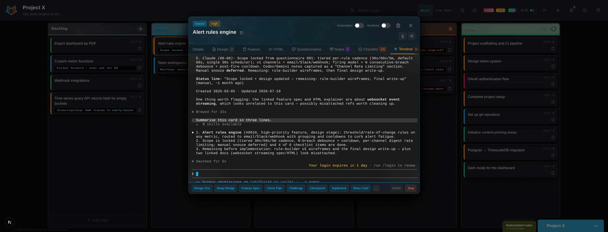
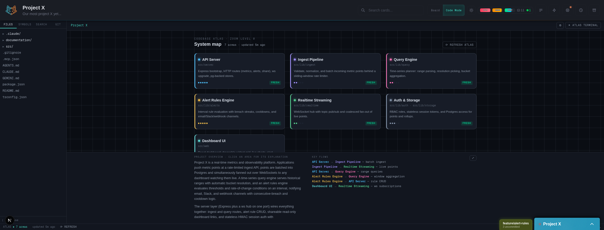

# SlyCode

A workspace manager for AI coding agents.

SlyCode gives each task its own workspace — terminal, context, and persistent session — so you can pick up any task exactly where you left off. It works with Claude Code, Codex, and OpenCode (Gemini CLI is still wired in), runs wherever you do — at your desk, on your phone, or walking through a park — and it's free for individuals.



*Click a card → the terminal is already mid-task. Send a voice note from your phone → the reply lands in the same session.*

<!-- TODO(launch): replace with documentation/assets/readme/card-is-the-workspace.gif — 30 s: click card → terminal already mid-task → voice note from the phone → reply lands. -->

## The Problem

CLI-based AI agents are genuinely good at what they do. But the more capable they get, the harder it is to manage them across multiple projects.

You're running several projects at once, each with its own context and momentum. Context switching is expensive — you lose your place, you lose your flow, and you burn energy just getting back to where you were. Sessions vanish when you close a terminal. Skills and configurations are scattered across projects and providers.

We built SlyCode because the biggest problem in AI development isn't the AI. It's everything around it.

## The Idea

Every project management tool separates planning from doing. The board tells you what to work on, then you switch to your terminal and pay the context-switch tax.

SlyCode's answer: **the card is the workspace.** Each card holds what needs to happen, why it matters, and an embedded terminal with a live AI session that already knows the task. Click a card and you're working — not setting up, not re-explaining the problem to the AI. Working.

Because each card keeps its scope contained, the AI stays focused longer. The session for Card A is exactly where you left it when you come back from Card B.

## Features

### Core

- **Embedded terminals in cards** — the card is the workspace, not just a tracker
- **Mobile + voice via Telegram** — full AI interaction from your phone, anywhere. Slack, Teams, and other channels coming soon.
- **Multi-provider support** — Claude Code, Codex, OpenCode (any model OpenCode can reach: ChatGPT, API keys, open models), Gemini CLI. Switch per card or per project.
- **Session persistence** — come back to any card and continue exactly where you stopped
- **Code Mode** — flip a project into a zoomable map of its codebase — areas, key files and symbols with AI-written summaries — and open the editor from any of them

### Workflow

- **Context priming** — your AI already knows your codebase when the session starts
- **Automated tasks** — scheduled context refreshes, documentation updates, morning standups
- **Card lifecycle** — backlog through done, with linked design docs, feature specs, and test plans at each stage
- **Questionnaires** — when the AI has a batch of questions it can attach a form to the card; you fill it in the dashboard and the answers land in the session
- **Verified prompt delivery** — prompts sent to a running session by automations, Telegram, or another card are checked against the terminal after Enter, so a dropped or queued prompt is reported instead of assumed
- **Quick-launch shortcuts** — save a Telegram deep link or web URL for a card as a phone home-screen shortcut, optionally with a starter prompt
- **Zero lock-in** — everything lives in your project directories. Remove SlyCode and nothing changes.

### Quality of Life

- **Cross-card search** — find any task from the web UI or Telegram
- **Card numbers** — every card has a short number (`#0274`) you can use in `sly-kanban` commands and Telegram
- **Board attention cues** — cards whose session finished producing output while you were away get a corner marker until you open them
- **Automation run history** — up to the last 20 retained runs of each automation — trigger, delivery outcome, error — are in its config modal
- **Skill management** — store, sync, and deploy skills across projects and providers
- **Deploy review** — pushing a store skill to a project from the dashboard shows each file's fate first — overwrite, new, unchanged, or kept — and lets you skip rows before confirming
- **Health monitoring** — see session status at a glance, shut everything down safely when you need to

## Code Mode



Code Mode is a second view of every project, next to the board. Instead of a file tree it opens on a **map** of the codebase — the areas that make it up, how they connect, and what each one is for — with a Files rail there when you want it.

- **Map first, then drill.** System map → area → the file's functions and classes as cards → the editor, opened at the symbol you picked.
- **Written by your own AI.** The Codebase Atlas behind the map is plain files in your repo. Your AI proposes areas and writes the summaries through the `sly-atlas` CLI, which validates every write. Run a first scan to build it; turn on the scheduled refresh to keep it current.
- **Guided tours, a catch-up digest, and a database schema view** — the parts of the codebase you need to understand today, in the order that makes sense.
- **An Atlas terminal beside the code.** Select code, hit Explain, and the session answers in context — and can jump the view to what it's talking about.

## Quick Start

Requires [Node.js](https://nodejs.org/) 20 or later.

```bash
# Create a new workspace (the directory name is up to you — "slycode" is just the default)
npx @slycode/create-slycode slycode

# Start services
cd slycode
npx slycode start

# Open the URL it prints — http://localhost:7591 unless you changed the port.
# On a fresh install, the first visit asks you to create a password.

# Check that everything is healthy
npx slycode doctor
```

<details>
<summary>Running the scaffold from a source checkout</summary>

You can run the scaffold tool from a clone instead of `npx`. Note that this is not an npm-free install: the workspace it creates depends on `@slycode/slycode`, which `npm install` fetches from the npm registry along with its runtime dependencies (express, ws, node-pty).

```bash
git clone https://github.com/slycode-ai/slycode.git slycode-source
cd slycode-source/packages/slycode && npm install
cd ../create-slycode && npm install
cd ../..
node packages/create-slycode/bin/create-slycode.js ~/slycode
cd ~/slycode
npx slycode start
```

</details>

## What Ships in the Box

SlyCode includes a set of skills that power the structured development workflow. These ship with the product — they're not plugins you install later.

**System**
- **Kanban** — card operations, checklists, agent notes, search, automations
- **Messaging** — routes text, voice, and images through Telegram (and future channels)
- **Atlas** — keeps the Codebase Atlas current: proposes areas, writes summaries, runs the refresh

**Workflow**
- **Design** — interactive requirements gathering that builds a design document as you talk through the problem
- **Feature** — creates a numbered feature specification from a design
- **Chore** — structured plans for maintenance tasks, bug fixes, and refactors
- **Implement** — executes a feature or chore plan, working through the checklist
- **Context Priming** — teaches the AI to create and maintain information-dense references for your codebase

**Utility**
- **Checkpoint** — git checkpoint of all recent changes

Skills are deployed into each provider's directory in your workspace (`.claude/skills/`, `.agents/skills/`) from a store copy you own. When you push a store update to a project, the deploy follows each skill's `updatable:` contract: files the skill declares as its own may be overwritten, and everything else in the project — your references, your edits — is kept.

## Common Commands

Run these from your workspace directory with `npx slycode <command>` (or plain `slycode <command>` if the CLI link is on your `PATH`).

| Command | Description |
|---------|-------------|
| `slycode start` | Start all services (web, bridge, messaging) |
| `slycode stop` | Stop all services |
| `slycode restart [service]` | Restart all services, or one of `web`, `bridge`, `messaging` (with the auto-start service installed; in manual mode use `stop` then `start`) |
| `slycode doctor` | Check your environment is healthy |
| `slycode skills list` | Show installed and available skills |
| `slycode skills check` | Check for new or updated skills |
| `slycode skills add <name>` | Add a skill to your workspace |
| `slycode skills reset <name>` | Reset a skill to the upstream version (overwrites your changes) |
| `slycode update` | Update SlyCode to latest and restart services |
| `slycode sync` | Refresh skill updates from the package (runs automatically on start) |
| `slycode service install` | Auto-start on login (Linux and macOS) |
| `slycode service remove` | Remove the auto-start service (Linux and macOS) |
| `slycode service status` | Check the auto-start service (Linux and macOS) |
| `slycode config` | View or change settings |
| `slycode reset-password` | Clear the dashboard password (the next visit asks for a new one) |
| `slycode uninstall` | Remove services and CLI tools (your files are preserved) |

Two companion CLIs are installed alongside it, for you and your AI sessions:

| Command | Description |
|---------|-------------|
| `sly-kanban` | Card operations from the shell — search, show, create, move, notes, checklists, automations |
| `sly-atlas` | Codebase Atlas maintenance — validated writes to areas, summaries, tours |

## Configuration

Edit `slycode.config.js` in your workspace:

```js
module.exports = {
  // '127.0.0.1' = localhost only (safest), '0.0.0.0' = all interfaces (remote access)
  host: '127.0.0.1',
  ports: {
    web: 7591,       // Web UI (command center)
    bridge: 7592,    // Terminal bridge (PTY management)
    messaging: 7593, // Messaging service
  },
  services: {
    web: true,
    bridge: true,
    messaging: true,
  },
};
```

Default ports spell **SLY** on a phone keypad (7-5-9).

`npx slycode config host 0.0.0.0` opens the dashboard to your LAN or tailnet; the bridge and messaging services always stay on localhost. If you installed the auto-start service, run `slycode service remove` and then `slycode service install` for a host change to take effect.

## Provider Support

SlyCode works with multiple AI coding agents:

| Provider | CLI | Status |
|----------|-----|--------|
| Claude Code | `claude` | Supported |
| Codex | `codex` | Supported |
| OpenCode | `opencode` | Supported — driven over its built-in API; run `opencode auth login` once per machine (ChatGPT Plus/Pro OAuth, API keys). Claude Pro/Max subscriptions can't be used inside OpenCode (Anthropic's terms); use an Anthropic API key for Claude models there |
| Gemini CLI | `gemini` | Supported — API key required for personal Google accounts |

- Switch providers per card or per project from the web UI or Telegram
- `slycode doctor` checks which providers are installed on your machine
- Each provider's CLI must be installed separately — SlyCode orchestrates them, it doesn't bundle them

**Gemini CLI with a personal Google account needs an API key.** Google has retired the individual Gemini Code Assist sign-in that personal Google accounts used, so for those accounts "Sign in with Google" no longer gets you a working session. Licensed Code Assist Standard/Enterprise, Google Cloud, and API-key authentication still work. The SlyCode path: create a key in Google AI Studio, add `GEMINI_API_KEY=<key>` to your workspace `.env`, and restart SlyCode.

## Known Limitations

- **Designed for one operator.** One shared dashboard password, no per-user accounts. Teams is the multi-user tier (below).
- **Localhost by default.** The dashboard binds to `127.0.0.1`. Telegram control from your phone works without exposing the dashboard or opening an inbound port (your messages transit Telegram's servers); to open the dashboard itself on your phone we put it behind Tailscale (`tailscale serve` in front of the web port) rather than the public internet. `npx slycode config host 0.0.0.0` exists if you know what you're doing.
- **Provider CLIs change under us.** Claude Code, Codex, and Gemini update their terminal UIs often. When one drifts, prompts into a running session are reported as unverified rather than assumed delivered, and we ship a fix — `npx slycode update` picks it up. OpenCode is driven over its API rather than its screen, so it isn't exposed to this.
- **Telegram is the only messaging channel today.** Slack and Teams are on the roadmap.

## License

SlyCode is source-available under the [Business Source License 1.1](./LICENSE).

**Free for:** personal use, non-commercial projects, education, evaluation, and open-source contributions.

**Requires a commercial license:** use by or on behalf of a company, organization, or entity with paid employees.

On **March 3, 2029**, the code converts to the [Apache License 2.0](https://www.apache.org/licenses/LICENSE-2.0).

For commercial licensing, visit [slycode.ai](https://slycode.ai).

## Provider Terms of Service

SlyCode is a workspace manager — it doesn't provide AI services directly. You authenticate with your own provider accounts and are responsible for complying with your chosen provider's Terms of Service.

**A note on API keys vs subscription plans:** Consumer subscription plans — Claude Max, ChatGPT Plus, Google AI Pro, and similar — are designed for ordinary individual interactive use. SlyCode is licensed for individual use on the free tier. If you're using SlyCode with multiple people, you'll need the Teams tier and API key authentication (usage-based billing) rather than personal subscription plans.

Review your provider's terms:
- [Anthropic Terms of Service](https://www.anthropic.com/legal/consumer-terms)
- [OpenAI Terms of Use](https://openai.com/policies/terms-of-use/)
- [Google AI Terms of Service](https://ai.google.dev/gemini-api/terms)

## Teams

A paid Teams tier is coming soon — shared workspaces, role-based access, and workflow integrations for organizations. [Stay updated.](https://slycode.ai)

## Getting Help

Bugs, questions, and ideas all go to [GitHub Issues](https://github.com/slycode-ai/slycode/issues). For a bug, run `npx slycode doctor` and paste its output — it includes your workspace path and other local details, so review it and redact anything you'd rather not post.

---

[slycode.ai](https://slycode.ai) · [Report an issue](https://github.com/slycode-ai/slycode/issues)
